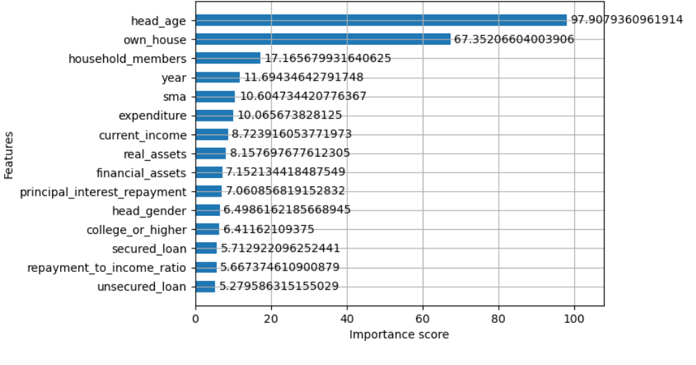
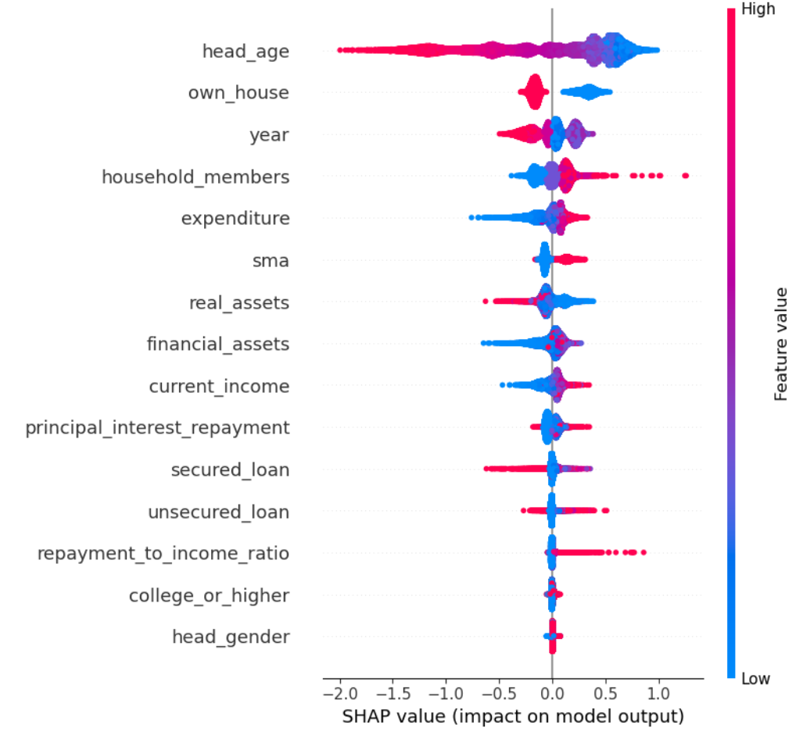

# Real Estate Investment Decision Prediction

2019~2025년 가구 데이터를 활용하여 **부동산 투자 의사결정을 예측하고 주요 영향 요인을 분석한 머신러닝 프로젝트**입니다.

## Project Overview

가구의 자산, 소득, 부채, 주거 특성 등 다양한 경제적 요인이 부동산 투자 의사결정에 어떤 영향을 미치는지 분석했습니다.

기존 연구에서 사용된 변수와 분석 방법을 참고하되, 분석 기간을 **2019~2025년까지 확장**하여 저금리 시기뿐만 아니라 고금리·부동산 조정기까지 포함했습니다.

최종적으로 XGBoost를 이용해 투자 의사결정을 예측하고, Feature Importance와 SHAP을 활용하여 주요 변수가 예측에 미치는 영향을 해석했습니다.

---

## Objective

주요 목표는 다음과 같습니다.

* 가구 특성을 기반으로 부동산 투자 의사결정 예측
* 투자 결정에 영향을 미치는 핵심 요인 분석
* 시점에 따른 투자 패턴 변화 탐색
* 설명 가능한 머신러닝을 활용한 결과 해석

**Target**

`investment_decision`

---

## Dataset

2019~2025년 가구 데이터를 연도별로 불러온 뒤 분석에 필요한 공통 변수를 추출하여 통합했습니다.

주요 변수:

* 가구주 연령
* 가구주 성별
* 가구원 수
* 주택 소유 여부
* 금융자산
* 실물자산
* 현재소득
* 지출
* 담보대출
* 비담보대출
* 원리금 상환액
* 소득 대비 상환비율
* 학력
* 조사 연도

---

## Analysis Process

1. 2019~2025년 데이터 로드
2. 분석 대상 변수 추출
3. 연도별 변수명을 공통 이름으로 통일
4. 연도별 데이터 통합
5. 결측치 및 이상치 처리
6. 범주형 변수 인코딩
7. Exploratory Data Analysis
8. XGBoost 모델 구축
9. 모델 성능 평가
10. Feature Importance 및 SHAP 분석

---

## Model Performance

| Metric    |  Score |
| --------- | -----: |
| Accuracy  | 0.6830 |
| Precision | 0.6577 |
| Recall    | 0.7074 |
| F1-score  | 0.6816 |
| ROC-AUC   | 0.7443 |

ROC-AUC가 약 0.74로 나타나 가구의 경제적·주거 특성을 기반으로 투자 여부를 일정 수준 구분할 수 있음을 확인했습니다.

---

## Model Interpretation

### Feature Importance



XGBoost Feature Importance 분석 결과 `head_age`, `own_house`, `year` 등이 주요 변수로 나타났습니다.

특히 가구주의 연령과 주택 보유 여부가 높은 중요도를 보여, **가구의 생애주기와 현재 주거 상태가 부동산 투자 의사결정과 밀접하게 관련될 가능성**을 확인했습니다.

### SHAP Analysis



SHAP을 활용하여 단순한 변수 중요도를 넘어 각 변수가 투자 의사결정 예측에 미치는 방향과 영향력을 확인했습니다.

---

## Key Findings

### 1. 가구주 연령과 주택 소유 여부가 핵심 변수로 나타남

`head_age`와 `own_house`가 높은 중요도를 나타내면서 개인의 생애주기와 주거 상태가 추가적인 부동산 투자 여부와 관련될 가능성을 확인했습니다.

### 2. 분석 기간 확장을 통해 `year` 효과 확인

2019~2025년 데이터를 통합한 결과 `year`가 주요 변수 중 하나로 나타났습니다.

이는 개인 및 가구 특성뿐만 아니라 **금리와 부동산 시장 상황 등 시점에 따른 거시경제 환경 변화도 투자 결정과 관련될 수 있음**을 보여줍니다.

### 3. 예측과 해석을 함께 수행

단순히 예측 모델의 성능을 확인하는 데 그치지 않고 Feature Importance와 SHAP을 함께 활용하여 모델이 어떤 정보를 기반으로 의사결정을 내리는지 분석했습니다.

---

## Project Highlights

* 7개 연도의 데이터를 하나의 분석 데이터로 통합
* 연도별로 상이한 변수명을 분석용 공통 변수로 매핑
* XGBoost 기반 Binary Classification
* Feature Importance 및 SHAP을 활용한 모델 해석
* 분석 기간 확장을 통한 시점 효과 탐색

---

## Tech Stack

`Python` `Pandas` `NumPy` `Scikit-learn` `XGBoost` `SHAP` `Matplotlib` `Seaborn`

---

## Repository Structure

```text
05_Real_Estate_Investment/
├── README.md
├── images/
│   ├── feature_importance.png
│   └── shap_summary.png
├── 01_Data_Analysis.ipynb
└── 02_Final_XGBoost_Model.ipynb
```
