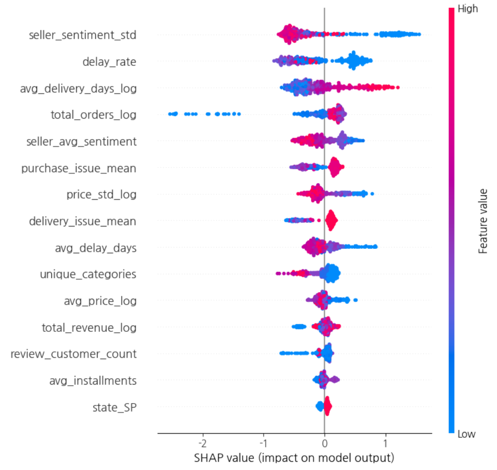

# Olist E-commerce Customer & Seller Analysis

브라질 E-commerce 플랫폼 **Olist**의 실제 거래 데이터를 활용하여 고객 및 셀러 행동을 분석하고, **셀러 이탈 가능성을 예측한 데이터 분석·머신러닝 프로젝트**입니다.

## Project Overview

E-commerce 플랫폼에서는 고객의 구매 행동뿐만 아니라 플랫폼에 입점한 셀러가 지속적으로 활동하는지 파악하는 것도 중요합니다.

본 프로젝트에서는 Olist의 고객, 주문, 상품, 결제, 리뷰, 셀러 데이터를 결합하여 분석용 데이터셋을 구축하고,

* 고객 구매 행동 분석
* RFM 기반 고객 Feature 생성
* 리뷰 텍스트 및 감성 정보 활용
* 셀러 운영 특성 분석
* 셀러 이탈 예측

까지 분석 범위를 확장했습니다.

---

## Dataset

**Brazilian E-Commerce Public Dataset by Olist**를 활용했습니다.

주요 데이터:

* Customers
* Orders
* Order Items
* Payments
* Products
* Reviews
* Sellers

원본 데이터는 여러 관계형 테이블로 분리되어 있어 분석 목적에 맞게 직접 병합하여 사용했습니다.

---

## Data Engineering

### 1. 관계형 데이터 병합

다음 Key를 기준으로 여러 데이터를 연결했습니다.

* `customer_id`
* `order_id`
* `seller_id`
* `product_id`

`items`, `payments`처럼 하나의 주문에 여러 행이 존재하는 데이터는 바로 병합할 경우 주문 수와 결제 금액이 중복될 수 있기 때문에 **주문 단위로 먼저 집계한 후 병합**했습니다.

### 2. Customer Features

고객의 구매 행동을 나타내기 위해 다음과 같은 Feature를 생성했습니다.

* Recency
* Frequency
* Monetary
* 지역 정보
* 배송 특성
* 주문 및 결제 특성
* 리뷰 점수 및 리뷰 수

### 3. Review & Sentiment Features

리뷰 데이터를 활용하여 셀러 평가와 고객 경험에 대한 Feature를 생성했습니다.

* 평균 리뷰 평점
* 리뷰 감성 점수
* 감성 점수 변동성
* 배송 관련 감성
* 가격 및 가치 관련 감성
* 제품 품질 관련 감성
* 구매 과정 관련 이슈

---

## Seller Churn Prediction

셀러별 주문, 배송, 가격, 리뷰 및 감성 Feature를 구축하여 **셀러 이탈 여부를 예측하는 Binary Classification 모델**을 구축했습니다.

주요 모델:

* XGBoost
* LightGBM

Hyperparameter Optimization에는 **Optuna**를 활용했습니다.

---

## Model Performance

| Model    | F1-score | ROC-AUC |
| -------- | -------: | ------: |
| XGBoost  |    0.692 |   0.832 |
| LightGBM |    0.698 |   0.827 |

F1-score에서는 LightGBM이 소폭 높은 성능을 보였으며, ROC-AUC에서는 XGBoost가 더 높은 성능을 보였습니다.

## SHAP Analysis



SHAP 분석을 통해 셀러 이탈 예측에서 어떤 변수가 중요한 역할을 하는지 확인했습니다.

주요 Feature:

* `delay_rate`
* `avg_delivery_days`
* `seller_sentiment_std`
* `total_orders`

---

## Key Findings

### 1. 배송 경험이 셀러 이탈과 밀접하게 연관됨

배송 지연률과 평균 배송 기간이 주요 Feature로 나타났습니다.

배송 품질이 좋지 않은 거래가 지속적으로 발생할 경우 셀러의 플랫폼 활동 지속 여부와 관련될 가능성이 있음을 확인했습니다.

### 2. 리뷰 평균뿐 아니라 감성의 안정성도 중요

`seller_sentiment_std`가 주요 Feature 중 하나로 나타났습니다.

단순 평균 평점뿐 아니라 리뷰 감성의 변동성 역시 셀러의 특성을 설명하는 데 활용될 수 있음을 확인했습니다.

### 3. 거래량이 낮은 셀러에서 높은 이탈 위험 관찰

`total_orders`가 주요 변수로 나타났으며 주문량이 매우 적은 셀러에서 상대적으로 높은 이탈 위험이 나타나는 경향을 확인했습니다.

다만 신규 셀러 역시 누적 주문량이 적을 수 있으므로 해당 Feature는 활동 기간과 함께 해석할 필요가 있습니다.

### 4. 비정형 텍스트 데이터도 이탈 예측에 활용 가능

리뷰 텍스트에서 추출한 감성 및 이슈 Feature가 실제 셀러 이탈 예측에 기여하면서, 정형 거래 데이터와 비정형 텍스트 데이터를 결합하는 분석의 가능성을 확인했습니다.

---

## Data Leakage Consideration

분석 과정에서 리뷰 평점과 리뷰 텍스트 감성 간 높은 연관성으로 인해 **Target Leakage 가능성**도 검토했습니다.

예측 시점에 실제 사용할 수 있는 변수인지 확인하면서 모델 성능뿐 아니라 Feature의 비즈니스적 타당성을 함께 고려했습니다.

---

## Project Highlights

* 여러 관계형 E-commerce 데이터를 직접 병합
* 주문 단위 중복을 고려한 데이터 집계 및 전처리
* RFM 기반 고객 행동 Feature 생성
* 리뷰 텍스트 및 감성 Feature 활용
* XGBoost·LightGBM 기반 셀러 이탈 예측
* Optuna 기반 Hyperparameter Tuning
* SHAP을 활용한 모델 해석
* Target Leakage 가능성 검토

---

## Tech Stack

`Python` `Pandas` `NumPy` `Scikit-learn` `XGBoost` `LightGBM` `Optuna` `SHAP` `NLP` `Matplotlib` `Seaborn`

---

## Repository Structure

```text
06_Olist_Ecommerce_Analysis/
├── README.md
├── images/
│   └── shap_summary.png
├── 01_Data_Preprocessing.ipynb
├── 02_Customer_Analysis.ipynb
└── 03_Seller_Analysis.ipynb
```
